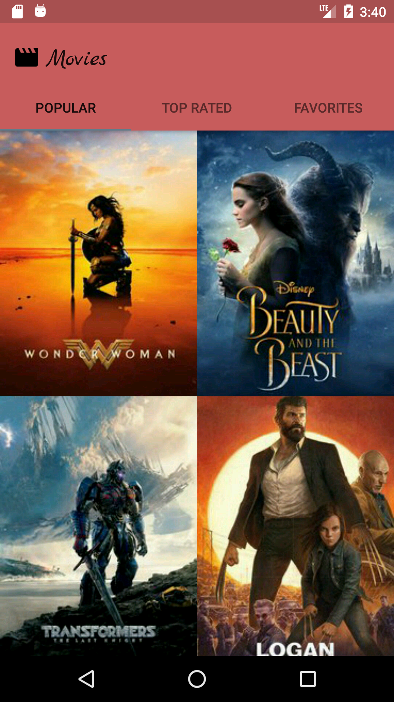
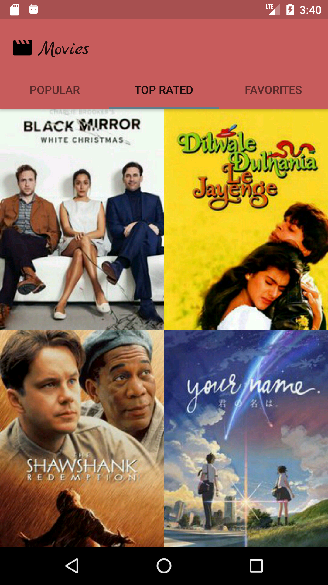
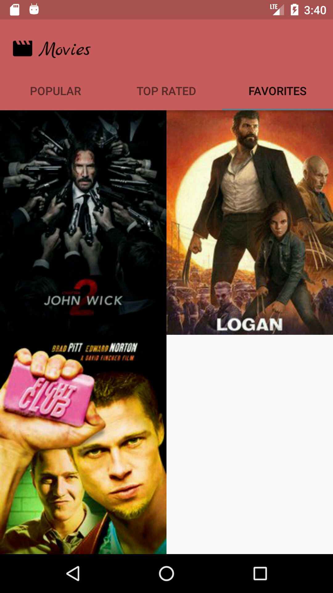
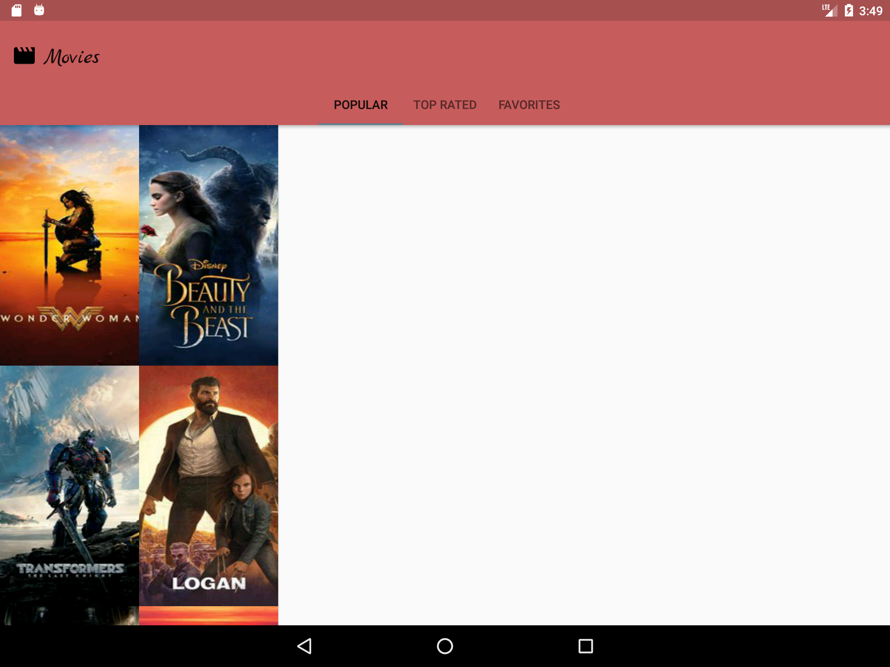
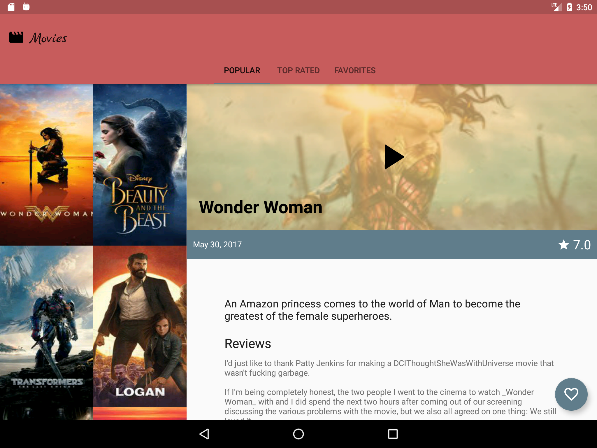
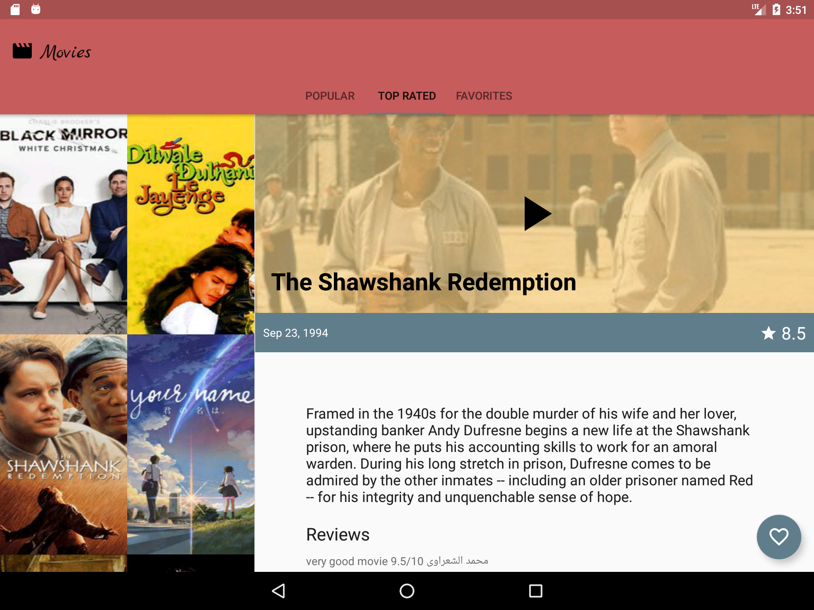
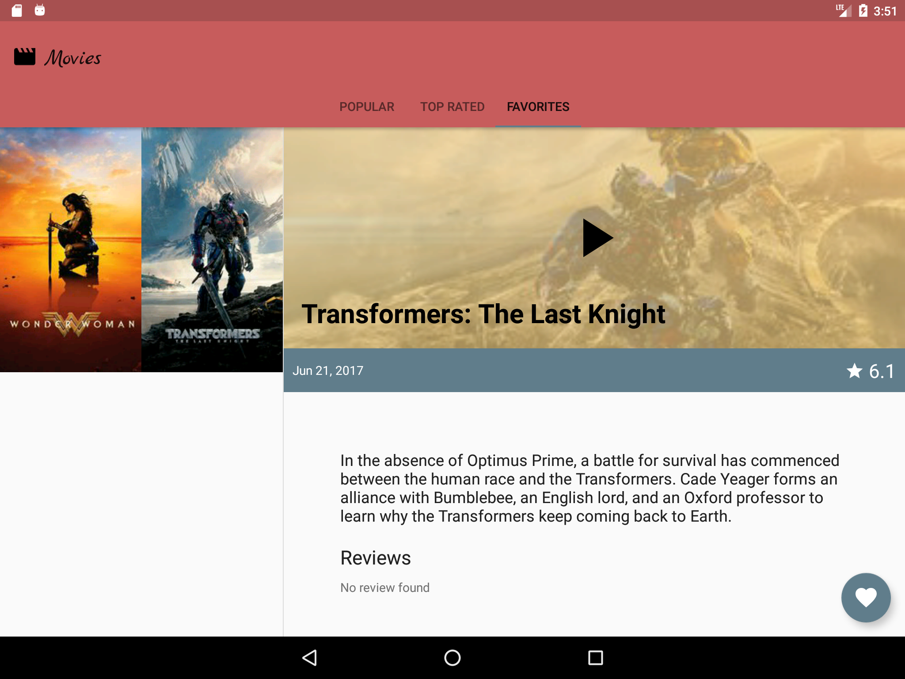

#  Android Movies App

> Android app to list popular and top rated movies from [The Movie Database](https://www.themoviedb.org/).

## Screenshots

### Mobile

|  |  |  |  |
| :---: | :---: | :---: | :---: |
| Popular | Top Rated | Favorites | Movie Details |

### Tablet

|  |  |
| :---: | :---: |
| Popular | Popular Details |

|  |  |
| :---: | :---: |
| Top Rated Details | Favorite Details |

## Getting Started

Create your TMDB API Key here: https://www.themoviedb.org/documentation/api

Modify the file `res/values/keys.xml` with the value of your API Key.

## References

- [TMDB API Key](https://www.themoviedb.org/documentation/api)
- [Why would I want to fitsSystemWindows?](https://medium.com/google-developers/why-would-i-want-to-fitssystemwindows-4e26d9ce1eec)
- [ViewPager](http://www.thiengo.com.br/viewpager-no-android-entendendo-e-utilizando)
- [Joda-Time](https://github.com/dlew/joda-time-android)
- [Iconics](https://github.com/mikepenz/Android-Iconics)
- [Icepick](https://github.com/frankiesardo/icepick)
- [Butter Knife](https://github.com/JakeWharton/butterknife)
- [EventBus](https://github.com/greenrobot/EventBus)
- [ProviGen](https://github.com/TimotheeJeannin/ProviGen)
- [DavidWebb](https://github.com/hgoebl/DavidWebb)
- [Glide](https://github.com/bumptech/glide)
- [RecyclerItemClickSupport](https://github.com/rohitshampur/RecyclerItemClickSupport)
- [Robotium](https://github.com/RobotiumTech/robotium)

**[Udacity Android Developer Nanodegree](https://udacity.com/course/android-developer-nanodegree--nd801/)**

- [Developing Android Apps](https://br.udacity.com/course/developing-android-apps--ud853/)
- [Advanced Android App Development](https://br.udacity.com/course/advanced-android-app-development--ud855/)
- [Gradle for Android and Java](https://br.udacity.com/course/gradle-for-android-and-java--ud867/)
- [Material Design for Android Developers](https://br.udacity.com/course/material-design-for-android-developers--ud862/)

## Credits

- [Iconfinder](https://www.iconfinder.com/icons/1055007/movie_play_video_icon#size=256)
- [Google Font Marck Script](https://fonts.google.com/specimen/Marck+Script)

## License

[MIT License](http://brenopolanski.mit-license.org/) © Breno Polanski
